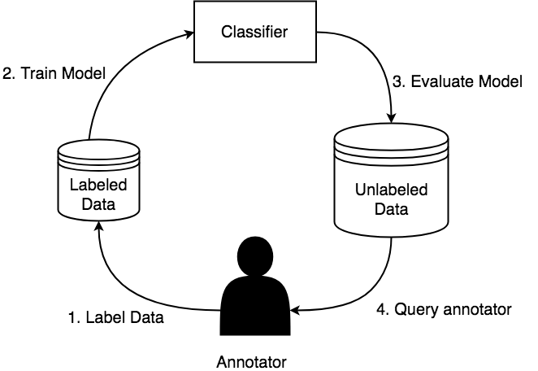
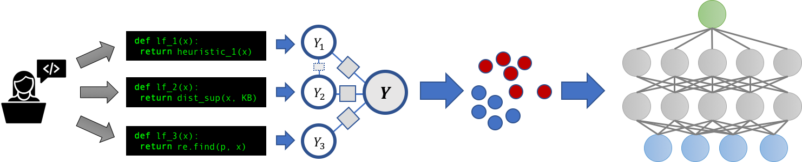

# Project Proposal

## Motivation

One of the biggest bottlenecks in machine learning pipelines is the amount of labeled data necessary to train a model. The problem setup is we have a large unlabeled corpus of documents and can ask an annotator to provide labels for the documents however there is an associated cost to annotate a document. The goal is to maximize model performance and minimize annotation cost. There have been various methods to reduce the amount of data needed to train machine learning models such as: transfer learning, active learning, and weak supervision to name a few. This project focuses on combining those 3. The goal being, as a user hand labels a set of instances, we generate a set of labeling functions that learn heuristics about the instances that have been labeled and apply it to the entire corpus, to get additional signal from unlabeled instances. The generic pipeline is described in figure 1.

*Figure 1: Description of a generic active learning workflow. (1) end user annotates data, (2) from the annotated data a model is trained, (3) the model is evaluated on the entire corpus, (4) a new query of data for the user to annotated is selected based on some heuristic, then process repeats*

In particular, we take a look at binary sequence classification problems such as NER (named entity recognition). We call our approach DPD (data programming by demonstration) as this is an application of programming by demonstration in the language domain. We build on top of Snorkel [1], a machine learning platform that introduces data programming where users write python functions to label their data, and train models to learn from it. This process is described in figure 2. We follow the traditional active learning pipeline (figure 1), where the training set is iteratively built up and a model is trained on it. During training we not only the use annotated data, but also the annotated instances to generate a set of labeling functions and apply to the unlabeled corpus to hopefully get more signal during training.

*Figure 2: Description of the snorkel pipeline. (1) Users write a set of labeling functions to noisily label their data. (2) A discriminative model is trained based on these labeling functions to produce probabilistic labels for a training set. (3) An end model is trained on these probabilistic labels to be the final classifier*

## Project Objectives

- Understand how natural language processing models can be used in environments with relatively low annotated data
- Understand what linguistic features are important to gain signal from an unlabeled corpus
    - Do word embeddings help give better signal than looking for keywords?
    - Do contextual embeddings give better signal than word embeddings, since sequence classification is heavily dependend on the context that the sequence appears in?
    - Do POS tags, constituencey parses, and dependency parses provide structural information that gives better signal than just semantic information in the word embedding space?
- Understand how to best generate labeling functions from a small set of annotated instances

## Minimum Viable Action Plan

1. Build a supervised pipeline for NER and other sequence classification tasks with BIO encoding
2. Evaluate a benchmark with random sampling to see how this compares against dataset sizes in `{1 ... 1000}`, with a heavier focus on sizes between `{1 ... 100}`
3. Investigate semi/weak supervision (presence of a small annotation set and a noisy set), with the following labeling functions
    1. Every positively annotated word gets stored in a dictionary and is in the noisy set is assumed to be true
        - The labeling function labels words that have already been annotated as positive
    2. Expand the dictionary above with word embeddings (GLOVE) to hopefully gather more data
        - The labeling functions labels words/phrases that are close to already labeled words in the word embedding space
    3. Expand the dictionary above with contextual word embeddings (ELMo/BERT) to hopefully be more relevant in context
        - The labeling function labels words/phrases that appear in a similar context to the already labeled words, where similar context is measured by euclidean distance or cosine similarity
    4. Investigate some structural method (described in stretch goals)

*Note: for each of the described methods above, in dictionary classifiers and structural methods, we will represent each of these as a labeling function and investigate various combinations of the labeling functions*

### Stretch Goals

Assuming the minimum viable plan goes as expected, the stretch goals are the following
1. Look into POS tags and see if patterns can be drawn there
   - Labeling functions could check to see if the POS tags match a regex patterns (e.g. `NN*` would refer to any noun phrases).
2. Look into constituency and dependency parses
   - Labeling functions could rely on Tree Kernels
3. Look into a mix of structural and word embedding based methods

## Methodologies

**Implementation**: We will build our models in PyTorch [12] and using AllenNLP [10]. We will build our system ontop of Snorkel [1]. We will compare our implementation against Snuba/Reef [2] and AutoNER [9], and use Snorkel MeTal [11] (an implementation of Snorkel for GLUE) to help with the finer grained details of writing models for sequence classification.

## Resources

**Training Data**: We will evaluate our pipelines on the, CADEC [7] Adverse Drug Reactions tag, and CONLL [8] PER tag (identifying people).

**Computational Resources**: The methods we propose do not rely on large amounts of computational resources, single GPU machines or maybe even CPU machines should be sufficient in the proposed project.

**Existing Codebases**:

- Snorkel [1] is a publicily available project (python library) that we intend to use
- SwellShark [3] is a paper that describes how Snorkel can be applied to sequence classification problems (biomedical NER), and we will follow the pipeline described there
- AutoNER [9] is released on github, and describes an implementation of a CRF that relies on probabilistic labels (Fuzzy CRF) as compared to gold labels. We will use this implementation in our experiments.

## Evaluation

We will evaluate our project through comparing F1 score with amount of annotated training data for a comparison. We will compare our methods against various benchmarks to see how it performs, in particular:

- Supervised learning on the datasets
- Active learning (no noisy set) on the datasets
- AutoNER and SwellShark reported performances
- Snuba/Reef
- Various combinations of labeling functions described in the Minimum Viable Plan

## Related work

Similar work has been done in Snuba/Reef [2] for text classification through bag of word features, however bag of words is not expressive enough for sequence modeling since context of the words and order of them matters. SwellShark [3] automatically generates a series of labeling functions for Biomedical NER, which is a promising start, however it relies on access to an external knowledge base, a rather limited set of labeling functions, and has been hand tuned for the tasks at hand. We hope to extend this in a more general setting by looking at (1) a more complex DSL by taking into account linguistic features such as (POS, Constituency Parse Trees, Dependency Parses) and (2) no reliance on an external knowledge base (KB). Babble Labble [5], describes a process in which users provide natural language explanations for a label, and labeling functions are generated based off of these descriptions. We will use the insights in this paper to see what features they extracted from explanations and see if they can be generalized, however our pipeline itself will not rely on explanations provided by users.  Lastly, AutoNER [9] relies on no human annotation but the presence of external dictionaries. We hope to rely on a small amount of human annotation as comapred to any external sources such as KB and dictionaries.

## References

1. Snorkel Project: https://hazyresearch.github.io/snorkel/
2. Snorkel Reef/Snuba: http://www.vldb.org/pvldb/vol12/p223-varma.pdf
3. SwellShark: https://arxiv.org/abs/1704.06360
4. Snorkel Labeling Functions Workshop: https://www.youtube.com/watch?v=mrIkus844B4
5. Natural Language Explanation to Labeling Functions (Babble Labble Snorkel): https://arxiv.org/pdf/1805.03818.pdf
6. Random Encoders for Sentence Embeddings: https://arxiv.org/abs/1901.10444
7. CADEC Dataset: https://www.ncbi.nlm.nih.gov/pubmed/25817970
8. CONLL Dataset: https://cogcomp.org/page/resource_view/81
9. AutoNER: https://github.com/shangjingbo1226/AutoNER
10. AllenNLP: https://allennlp.org/
11. Snorkel MeTal: https://github.com/HazyResearch/metal 
12. PyTorch: https://pytorch.org/