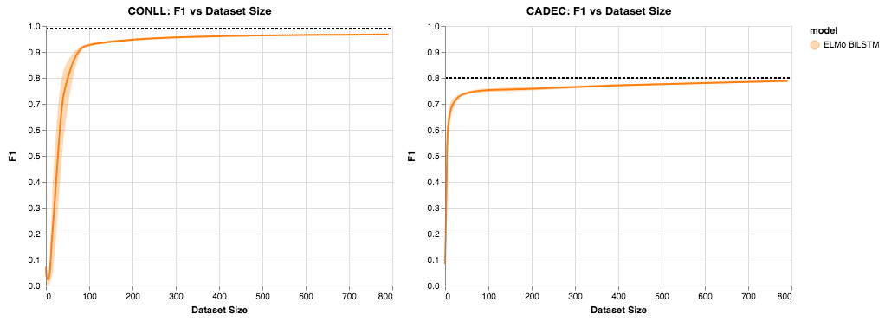

# Initial Baseline Approach

As our initial baseline approach we report the performance of the following experiments

1. Supervised approach
    - We train our model fully supervised to establish a baseline, this has not been fully tuned by the performance is reported
2. Active Learning w/Random Sampling
    - Establish a basline of an active learning method
3. Creating a noisy set with keyword matching and weighted training

## Model

For the experiments here we use an ELMo word embedding layer that feeds into a bidirectional LSTM and finally has a CRF tagger. It is important to note here that we freeze ELMo and use it as a feature extractor as comapred to fine tuning because this allows us to cache all the ELMo vectors, and gives us a massive improvement in runtime over having to run ELMo for each iteraiton. It has also been noted that for NER, there is not a substantial difference between freezing ELMo and fine tuning [1 Peters et al. 2019].

We also hypothesize this helps during our active learning experiments, since the training set size will be quite small.

ELMo learns a scalar mix representation of all of its layers during fine tuning, since we are not fine tuning, we use the scalar mix parameters from the Ai2 released ELMo model for Named Entity Recognition.

## Datasets

As mentioned in earlier blog posts, we will investigate two datasets.

1. CoNLL 2003: PER tag
    - The task simplifies to identifying mentions of people in text
    - [2 Sang et al. 2003]
2. CADEC: Adverse Drug Reaction (ADR) tag
    - The task is identifying adverse drug reactions in patient authored drug reviews
    - [3 Karimi et al. 2015]

We have supervised benchmarks and a random sampling active learning benchmark on both datasets, however for our baseline of keyword matching, we have only experimented with CADEC.

## Training

Our supervised and active learning experiments use the following configuration:

Training Supervised:

- batch size of `1`
- epochs: `15`
- Using `SGD` config described below

Active Learning Training:

- Increase our dataset in increments of `[1, 5, 10, 25, 50, 100, 200, 400, 400]`
- At each iteration train our model with batch size `1` and `5` epochs
- Using `SGD` config described below

SGD:

- learning rate of `0.01`
- weight decay of `1e-4`

Hyper Parameters:

- ELMo embedding dimension: `1024`
- BiDirectional LSTM
- LSTM hidden dimension of `500` in each direction, concatted for `1000` total

## Experiments

### Supervised

*Note: this experiment was done previously*

The F1 score of the model on the valid set is reported below

| Model                   | Conll2003 PER | CADEC ADR |
|-------------------------|---------------|-------------|
| ELMo BiLSTM CRF         | 0.99           | 0.80        |

### Active Learning with Random Sampling

*Note: this experiment was done previously*

*The graph above shows the average of 10 trials of active learning through random sampling, the dotted line notes the max performance from our supervised experiments, along with the area surrounding the line showing the 95% confidence interval*

### Weak Supervision with Keyword

For the sake of this blog post, we only ran a single trial for each of the experiments below, before we do further analysis more will have to be run.

#### Weighted Equally

#### Noisy Set has 0.1 Weight

#### Noisy Set has 0.01 Weight

## References

1. To Tune or Not to Tune? Adapting Pretrained Representations to Diverse Tasks
    - Matthew Peters and Sebastian Ruder and Noah A. Smith
    - 2019 CoRR
    - [Paper](https://arxiv.org/abs/1903.05987)
2. CONLL Dataset (Introduction to the CoNLL-2003 Shared Task: Language-Independent Named Entity Recognition)
    - Erik Tjong Kim Sang and Fien De Meulder
    - 2003 CoNLL
    - [Paper](https://arxiv.org/pdf/cs/0306050.pdf)
    - [Dataset](https://cogcomp.org/page/resource_view/81)
3. Cadec: A corpus of adverse drug event annotation
    - Sarvnaz Karimi and Alejandro Metke-Jimenez and Madonna Kemp and Chen Wang}
    - 2015 Journal of biomedical informatics
    - [Paper](https://www.ncbi.nlm.nih.gov/pubmed/25817970)