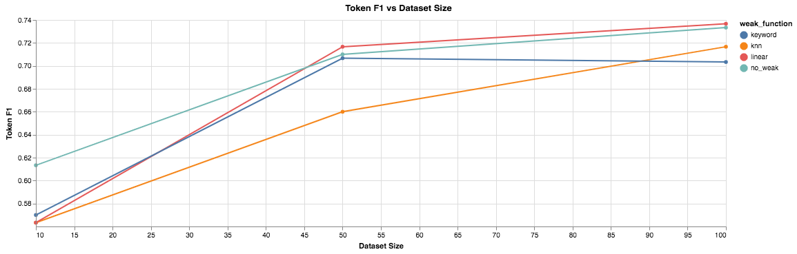
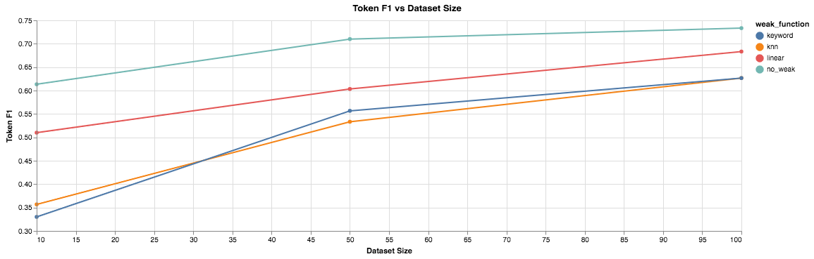

# More Baslines and Analysis!

[Blog Main Page](README.md): has links to all the previous blog posts.

## Somethings from the last blog post

There were somethings left unclear in the last blog post, so I wanted to address them here.

- **What is dataset size and how does this compare with the noisy set and the gold set?**

The dataset size refers only to the gold set size. The way I have it implemented right now, we have a labeled and unlabeled corpus where the two of them put together is the total number of training instances avaiable in CADEC (e.g. `1000`). So when the dataset size is at `100`, this would mean that the true dataset size is `100` and the unlabeled set is `900`. The noisy set is constructed by applying our heuristics to the unlabeled corpus, not the union, so it is not fixed.

Maybe I should use the entire dataset for the noisy set including already labeled instances, not just the unlabeled corpus. I haven't thought of that, but it may help.

The purpose of the dataset size being the number of gold instances is simply to give a proxy to annotation cost, that on average if someone spent time labeling 50 instances or 100 instances, from emprical results this could be their gain.

- **User studies**

For the purpose of this project, I will use already labeled datasets and simulate an active learning environment, by creating an unlabeled corpus by simply removing those labels and allowing an annotator object to just provide those labels to the system when requested. This also gives a good abstraction to experiment with noisy annotators (what if only 90% of the time the annotation was correct), if we chose to go down that route.

- **Metadata**

One of my classmates, `Byran Hanner`, mentioned adding some form of metadata on top of text features. It would be really interesting to see how features outside of text could help in generating this noisy set. However, I want the system to be as general as possible, and am not quite sure what assumptions I could make on the availability on metadata, maybe some generic knowledge base such as Freebase or DBpedia could help in this. While it may not be something I can focus on given we only have 6-7 weeks left, it is definetly something on my list of things to explore.

- **Evaluation Metric F1**

This was left out from the previous blog post, but the evaluation metric is a **Token** level F1 score instead of a span F1 score. The rationale here is that in the CADEC dataset, the spans can get a few tokens long, and if a single token is left out of the span, this is considered to be a false positive and can hurt the F1 score quite a bit. Instead we take a look at the token level F1 score. If you want to see the Sppan F1 score, I am happy to report that as well.

- **Weighted Training and Keyword Matching**

As mentioned in the [last blog post](blog_4.md), I would report the performance of building a noisy set based on `keyword matching`, using a 10 run average and plotting confidence intervals. The results are presented in the graph below:

With relatively high weights (`1.0` and `0.1`) we notice our weighted training to be quite noisy depending on the random seed, and we notice the other weights (`0.01`, `0.001`, and `0`) perform relatively the same. Since we want to investigate how we can best build this noisy set, we continue our experiments with using a weight of `0.01`, as this is not so large that it impacts performance of our model drastically, and not so small that training ignores the weak set.

*However, these experiments took a long time to run, since a model is retrained at each data point, to allow quicker iteration on prototypes, we reduce the number of trials to 3 and data points to just dataset sizes of `[10, 50, 100]`.*

## Baseline Descriptions

Here we evalaute our noisy set construction through the various heuristics described below:

- Keyword Matching
- GloVe kNN
- GloVe Linear
    - Logistic Regression
    - SVM

We convert each of these heuristics to **weak labeling functions** by using these heuristics to predict sequence level labels (`BIO` encoding, where `B` and `I` are considered positive labels and `O` is considered a negative label). This naturally extends to the final project, where we evaluate how multiple functions can be combined together to create a stronger noisy set.

*Note: I do not explain the model hyper parameters / training here, but it is all mentioned in detail in my [previous blog post](blog_4.md), TL:DR; the model trained is an ELMo -> BiLSTM -> CRF tagger with ELMo Frozen, the model is trained by mixing the gold (true annotations) and the noisy (noisy annotations on unlabeled data) and weighting them differently to vary the influence of the noisy set.*

### Keyword Matching

As mentioned in the [previous blog post](blog_4.md) one of the baseline approaches, I took a look at was simple keyword matching. In particular, if we have our training data T, extract all the positively labeled words in T, and label them as positive in our noisy set and do some weighted training.

### GLOVE embedding space

The limitations of the keyword matching approaches is that they do no generalize to unseen words, which is a rather large limitation given our set of positively annotated words can be quite small.

We look to overcome this limitation by looking at expanding this set of positively annotated words by using an embedding space to augment this dictionary of positve words. In particular we take a look at using a `kNN` approach, then `logistic regression`, and finally `SVM`. Descriptions and rationale for each are listed in the associated sections below.

#### kNN

Using `FAISS` [1 Johnson et al. 2017], we index all the GLOVE word embeddings (with embedding dim `d`). Then we use our dictionary of positively labeled words to form a query which contains the embedding vectors for each of the words in the dictionary (shape `(num_words, d)`). We then search for the closest `k` vectors using `cosine similarity` as our similarity metric.

The result we get back is `(num_words, k)` giving the `k` closest vectors for each word in the query. We then convert this to a ranked list where we represent our similar words as `(word, count)` where count is the number of times the word appears in our result matrix.

#### Logistic Regression

When analyzing the results of the `kNN` approach, we find that while most words are relevant, some of them are not. We suspect this is because the concept we want to capute (e.g. `Adverse Drug Reactions`) for our dataset may be similar in some dimensions and different in others, which could potentially cause the `kNN` approach to fail.

To overcome this instead we take all our positive words, and sample our negative words to create a training set. Where `w_i` has an embedding vector `e_i` and an associated label `l_i`, where `l_i = 1` if `w_i` is positive and `l_i = 0` if `w_i` is negative. We then create a training set where the input is `e_i` and the output is `l_i`, and train a logistic regression model.

Once our logisitc regression model is trained, we run the model over all the words in the glove embedding space, and conver this to a ranked list of similar words as `(word, prob)` where prob is the probability that the word belongs to the positive class.

*This is all implemented using `Sklearn` [2 Pedregosa et al. 2011]*

#### SVM

Similar to the approach above we attempt to the same algorithm except replacing the logistic regression model with an SVM of different kernels.

- Linear Kernel
- RBF Kernel
- Quadratic Kernel

## Performance Report

*Note: in the graphs presented throughout this section, the y axis scale changes to better see the differences in the lines.*

In this section we report the performance of the various baselines we tested.

All the experiments are run on the CADEC dataset [3 Karimi et al. 2015], with the task of identifying *Adverse Drug Reactions* (`ADR`) in patient authored drug reviews.

First we consider, what if we just used the heuristics above to label our entire valid set, and see what our reported performances are for each of these functions. In particular, given a randomly sampled training set of 50 instances, if we generated our weak functions based on the heuristics described in baselines, what would our performance be on the dev set. The table below shows the results averaged over 3 runs.

<!-- | **Weak Function**         | **Precision** | **Recall** | **F1**   |
|-----------------------|-----------|--------|------|
| Keyword Matching      | 0.33      | 0.47   | 0.39 |
| kNN                   | 0.20      | 0.62   | 0.30 |
| Logistic Regression   | 0.36      | 0.56   | 0.44 |
| SVM: Linear Kernel    | 0.36      | 0.57   | 0.44 |
| SVM: Quadratic Kernel | 0.36      | 0.55   | 0.44 |
| SVM: RBF Kernel       | 0.36      | 0.57   | 0.44 | -->

| **Weak Function**         | **Precision** | **Recall** | **F1**   |
|-----------------------|-----------|--------|------|
| Keyword Matching      | 0.40      | 0.46   | 0.43 |
| kNN                   | 0.28      | 0.55   | 0.37 |
| Logistic Regression   | 0.43      | 0.54   | 0.48 |
| SVM: Linear Kernel    | 0.43      | 0.55   | 0.48 |
| SVM: Quadratic Kernel | 0.41      | 0.47   | 0.44 |
| SVM: RBF Kernel       | 0.43      | 0.55   | 0.48 |

One thing to note here is that the linear functions seem to perform the best, with a rather small increase in precision but large increase in recall giving a better F1 score as compared to a keyword matching baseline. `kNN` seems to perform the worst, but has comparable recall, which makes sense since the `kNN` based approach will draw in random similar words as compared to the linear approachs (`logistic regression` and `svm`), which specifically look to capture a concept.

Now to run our active learning experiments, we simplify the number of heuristics we are testing to 3: Keyword Matching, `kNN`, and linear (`SVM Linear Kernel`), along side our baseline of using no heuristics and only training on the training data. We look at random samples of `[10, 50, 100]`. The results (average of 3 trials) are presented below. We train by weighted training, we give our gold set a training weight of `1.0` and our weak set a training weight of `0.01`.

As compared to the earlier baseline experiments from the last blog post, we can see that our linear method (`SVM Linear`) is producing better results than relying on keyword matching or `kNN`, and at a dataset size of `50` and `100` is marginally performing better than our random baseline approach.

These results also show, especially with regards to the table above, that the different functions are capturing different things (e.g. `kNN` has high recall and `linear` has a comparitive higher precision), this leads into our goal for the next advanced solution to look into some way of using multiple heuristics together.

We can further analyze the affect of different weak functions by increasing the weight of the weak set (by a degree of magnitude) to `0.1`, while this performs much worse, we can see that using a `linear` weak function performs better than the other weak functions.

## Error Analysis

In this section we analyze the performance of the weak functions descibed earlier, specifically by digging through the augmented dictionary.

### Augmented Dictionary Top 10 items

We ran an experiment where we randomly sample 50 instances from our CADEC training set. We then get all the positvely labeled words from our dataset, and create a "dictionary". We then augment this dictionary through one of the various baseline implementations described above. The top 10 words in each augmented set (does not include words already positively labeled) is shown below. We select the top 10, by soritng by the probability for the `SVM` and `Logistic Regression` based functions and by the number of positive neighbors in the `kNN` based function.

| **kNN**      | **Logistic Regression** | **SVM: Linear** | **SVM: RBF**  | **SVM: Quadratic** |
|-----------|---------------------|-------------|-----------|----------------|
| ankle     | numbness            | numbness    | numbness  | dizziness      |
| vomiting  | rashes              | dizziness   | dizziness | nausea         |
| shortness | dizziness           | rashes      | rashes    | numbness       |
| groin     | protruding          | blisters    | blisters  | headaches      |
| anxiety   | bruised             | faint       | nausea    | vomiting       |
| hamstring | irritability        | itching     | cramps    | cramps         |
| elbow     | itchy               | bruised     | craming   | aches          |
| maybe     | swollen             | tingling    | twitching | cramping       |
| worried   | lethargy            | slurred     | vomiting  | sore           |
| lips      | blisters            | coughing    | aches     | aching         |

Here we can see that our `linear` models are gathering terms more related to adverse drug reactions than `kNN` is.

### Span F1

Another interesting thing is to evaluate the Span F1 metric. In constrast to Token F1, Span F1 looks at the F1 if we only consider exact span matches. This will provide us more insight as to how many of the spans are actually being predicted properly. The results are presented in the graph below.

In particular, take a look at the `linear` weak function as compared to our benchmark of `no_weak`. Although the average improvement is mariginally it does show consistent improvement on the Span F1, which shows some promise.

## Next blog post

Now that we have experimented with a good set of single labeling functions, the next thing to do is look at more advanced solutions, and I have 3 directions in mind that can be worked on in parallel.

1. Use Snorkel to use multiple labeling functions at once, and use it to generate a weak set
2. Replace GloVe with a contextual embedding space (ELMo or BERT)
3. Weighted training might not be appropriate it may be better to experiment with tune the model on the noisy set, and then "fine tune" it on the gold set

## References

1. FAISS (Facebook AI Simlarity Search)
    - Johnson, Jeff and Douze, Matthijs and J'egou, Herv'e
    - 2017 arxiv
    - [paper](https://arxiv.org/abs/1702.08734)
    - [github](https://github.com/facebookresearch/faiss)
2. Scikit Learn
    - Pedregosa, F. and Varoquaux, G. and Gramfort, A. and Michel, V. and Thirion, B. and Grisel, O. and Blondel, M. and Prettenhofer, P. and Weiss, R. and Dubourg, V. and Vanderplas, J. and Passos, A. and Cournapeau, D. and Brucher, M. and Perrot, M. and Duchesnay, E.
    - 2011 Journal of Machine Learning Research
    - [Github](https://github.com/scikit-learn/scikit-learn)
3. Cadec: A corpus of adverse drug event annotation
    - Sarvnaz Karimi and Alejandro Metke-Jimenez and Madonna Kemp and Chen Wang}
    - 2015 Journal of biomedical informatics
    - [Paper](https://www.ncbi.nlm.nih.gov/pubmed/25817970)
