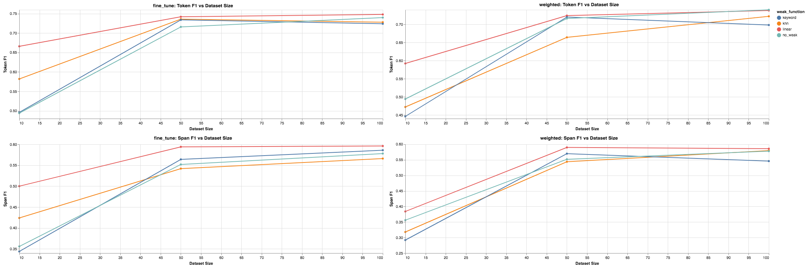
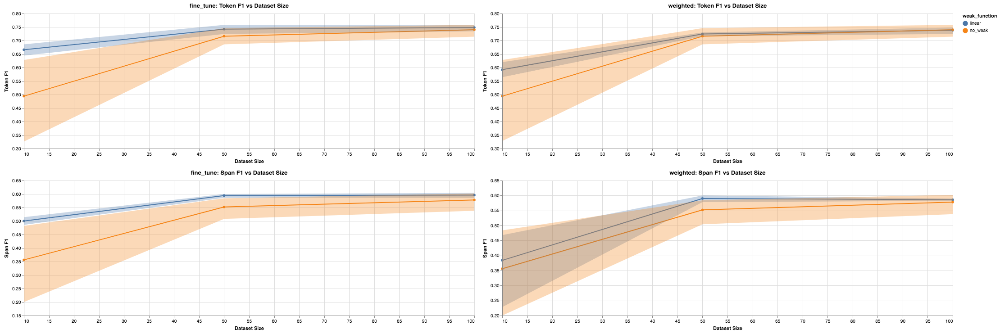
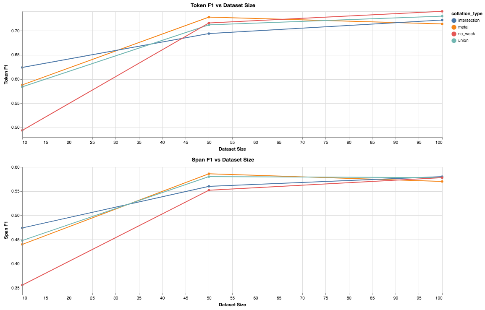

# Advance Solution #1

[Blog Main Page](README.md): has links to all the previous blog posts.

## Addressing things from the last blog post

I've decided I will use the begginging of each blog posts to give quick generic updates

### Is CADEC a messy dataset

A part of my comments on canvas was: `Was "craming" a typo  in the SVM: RBF column? Or is this a messy dataset that contains many misspellings?`

This dataset was collected by scraping posts from [Ask a Patient](https://www.askapatient.com/), so these posts often contain misspellings and extraneous punctuation, which is part of what makes this dataset challenging. More about this dataset can be found in the [paper](https://www.ncbi.nlm.nih.gov/pubmed/25817970) [1. Karimi et al. 2015].

### Some issues...

#### Dev/Test split

The dev/test split I was using wasn't consistent with my previous work, which was a mistake I made when I ported the code from my PyTorch implementation to AllenNLP. I have reran all my experiments so this is updated, and a good thing is that the results are still similar.

#### Random sampling

A part of this challenging is training a model on `10` random samples, then `50` random samples, and then `100` random samples. And even though I ran multiple trials and was comparing the average, I never guaranteed that when I compared two methods, they should be compared on the same random samples. I updated the experiments to show this instead, and the results for using a single `heuristics/labeling functions` are much stronger.

#### Training Methods

Last week, I pointed out that weighted training might not be the best method. So I have a series of experiments here to compare `weighted` and `fine tune` training. Where when I say `fine tune`, I mean train a model on the noisy labels first, take the best performing model there and train that model with a higher learning rate on the gold training instances.

**Note: I don't want to confuse `fine_tune` with fine tuning our contextual embeddings that are used in the model described in [blog 4](blog_4.md). To clarify `ELMo` is frozen, and not updated. If there is a better term to use for this training than fine tuning, do let me know and I can be more consistent in the next blog post to avoid this confusion.**

##### Results

The updated results from the 3 baseline labeling functions, comparing training methods are shown below.

When using our `fine_tune` training method, we can see that our results are much better and the `linear` weak function is performing much better than our `no_weak` baseline. Digging into this further:

We plot the 95% confidence intervals for our `no_weak` baseline and our `linear` weak function and we see that for our `Span F1` metric the difference between the `no_weak` baseline and our `fine_tune` + `linear` weak function method is performing better.

## First Advanced Solution

With the results from my [previous blog post](blog_5.md), we can see the benefit from using a single labeling function, but what happens when we want to use many of these together, the hypothesis being that we can gain additional signal from a diverse set of labeling functions to create stronger noisy labels. This comes in two challenges.

1. How can we combine many labeling functions? (This blog post)
2. What other labeling functions will help? (next blog post)

In this blog post I address the collation methods, and a series of experiments to show what is performing best. In particular I take a look at 3 collation methods `union`, `intersection`, `snorkel`.

### Union

In this approach we optimize for recall. If a single labeling function denotes a word as positive, we provide it a positive label.

### Intersection

In this approach we optimize for precision. If all labeling function denote a word as positive, we provide it a positive label.

### Snorkel MeTal

In this approach, we a machine learning system called Snorkel [3. Ratner et al. 2017]. Snorkel uses statistical machine learning models to model dependencies between labeling functions and learn probabilistic labels. In this method, we select the most probable label and use that for our noisy set. This is titled `metal` because, snorkel recently introduce a new framework `Snorkel MeTaL` [4. Hancock et al. 2019] that achieved a state of the art result on `GLUE`. The main differences are for multitask learning, but they did do some refinement of the Snorkel model in this project, so I build ontop of this.

## Experiment Results

Below we graph the `Token F1` and the `Span F1` scores, for the 3 collation methods described above and a `no_weak` baseline, that uses no weak set. We collate the `keyword matching`, `kNN`, and `linear` weak functions described in the [previous blog post](blog_5.md). The training method we use is `fine_tune`. The results are averaged over 5 runs.

We can see that our `metal` (Snorkel) collation methods performs slightly better at a dataset size of `10` and `50` and a bit worse at `100`.

These results are somewhat expected. Right now, we have a rather large limitation that all our labeling functions look at the same thing: either exact matches or similar words in the GLOVE embedding space. The authors of `snorkel` encourage users to write a diverse set of labeling functions to make the most of the system. This makes it quite clear that our next step is to write many labeling functions that cover a diverse set of features, in particular `ELMo`, `BERT`, `POS tags`, and maybe `parse trees` are the next set of labeling functions I will look at (in that order). We now however have an infrastructure in place to collate multiple labeling functions and leaving us with the task of experimenting with as many labeling functions as we can.

## References

1. Cadec: A corpus of adverse drug event annotation
    - Sarvnaz Karimi and Alejandro Metke-Jimenez and Madonna Kemp and Chen Wang
    - 2015 Journal of biomedical informatics
    - [Paper](https://www.ncbi.nlm.nih.gov/pubmed/25817970)
2. Unsupervised Data Augmentation
    - Qizhe Xie, Zihang Dai, Eduard Hovy, Minh-Thang Luong, Quoc V. Le
    - 2019 Arxiv
    - [Paper](https://arxiv.org/abs/1904.12848)
3. Snorkel: Rapid Training Data Creation with Weak Supervision
    - Alexander J. Ratner and Stephen H. Bach and Henry R. Ehrenberg and Jason Alan Fries and Sen Wu and Christopher R'e
    - 2017 VLDB
    - [Project Website](https://hazyresearch.github.io/snorkel/)
    - [Paper](https://arxiv.org/abs/1711.10160)
4. Snorkel MeTal
    - Braden Hancock, Clara McCreery, Ines Chami, Vincent Chen, Sen Wu, Jared Dunnmon, Paroma Varma, Max Lam, and Chris Ré
    - 2019
    - [Blog Post](https://dawn.cs.stanford.edu/2019/03/22/glue/)
    - [Github](https://github.com/HazyResearch/metal)