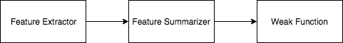
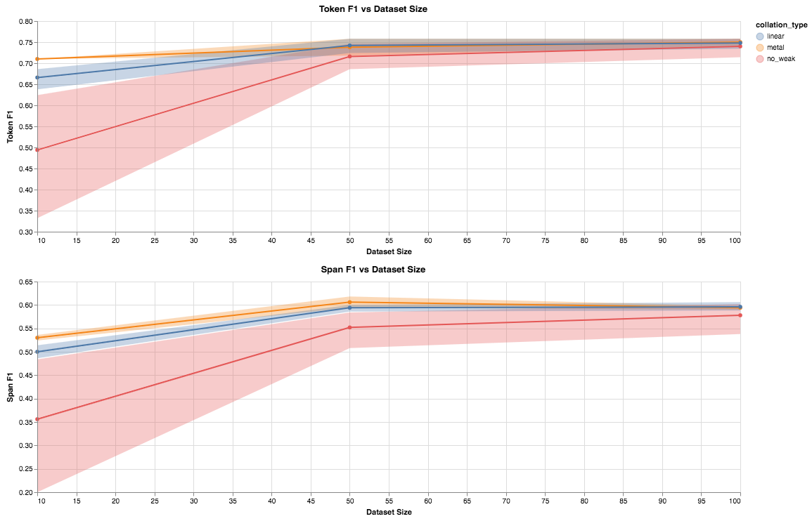
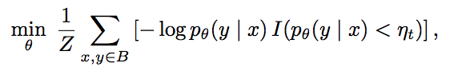

# Continue Advance Solution #1

[Blog Main Page](README.md): has links to all the previous blog posts.

## Addressing things from the last blog post

### POS functions

Part of my comments were `The word/span -> positive selection for labeling functions is fairly intuitive; do you think this intuition will extend to POS tags/parses?`

Reponse: I think (and the way I have been working on this) was to directly extend the intuition. While this may not be clear as to why because predicting something like an adverse reaction soley based on the POS/parse features is not going to work, it will be used along side many other labeling functions and weak classifiers. So while it may not be perfect, it provides some supervision as to what our model should be learning from this noisy set.

### Group Feedback

I am working by myself (at least in the context of this class), so I will use this area to mostly reflect on what has been going on this quarter. While this project does look quite large from the outside, I want to mention that the entire Active Learning component of this pipleline and modeling components have been done in previous work before this class. That being said, what I am finding is that the number of things to try for this project is growing larger and larger, and may habe been a bit ambitious for me to complete in 10 weeks. With that in mind, I do think I have been progressing quite well with the experimentation and engineering work. To keep this pace up, it will be important for me to decide one path to focus on for the rest of the quarter, and I will explain that direction towards the end of this post.

## Continuing Advanced Solution

In my [previous blog post](blog_6.md), I mentioned that the advanced solution I was working on was collation of weak functions. In particular, how can we combine multiple labeling functions produce a stronger weak set. Parallely, I also was working on incoporating various new weak functions into my pipline and experimenting with them. The challenge here became a lot of engineering work ontop of experimentation too. In this section, I will go over the engineering challenges I was working on, and the various experiments I ran.

### Labeling Function Generating Pipelines

After some thought the set up for generation of a labeling function, each labeling function is designed to predict what class each individual word belongs to. The processe is depicted below:



* **Feature Extractor**: Is what converts each word into a `(1, embedding_dim)` vector of features. The ones I have implemented are: (`ELMo`, `BERT`, `GloVe`, `word (one hot)`, `POS tags (one hot)`).
* **Feature Summarizer**: Suppose a function takes in a series of features, for example the window function takes `window_width` number of features for each instance. Feature summarizer is a simple transform that decides how these features are combined. This could be either `sum` to add all the features together or `concat` to concatenate them together, to retain some information about order.
* **Weak Function**: This is actual function to apply. For example, `exact match` checks to see if the incoming feature has been seen before, and if it has assigns it a label. Linear trains a `svm_linear` classifier to classify positive and negative terms in the training data. `kNN` does the same thing except with the `kNN` algorithm. Lastly, window takes a `window_dim`, and uses the context of `window_dim` items before the current word and `window_dim` items after the current word to classify the current one.

Each of these functions support the following two operations:

* **Train**: Given an annotated set of data, the labeling function trains itself based on the extracted features on this set
* **Evaluate**: Given an unlabeled set of data, runs this labeling function to produce noisy labels

Enumerating a subset of all posibile combinations of these we end up with around 27 labeling functions we need to train and apply.

### Engineering Work

Now that we have 30 labeling functions, at each iteration we need to train them on the training sample we have (`10`, `50`, and `100`). Each of these functions most likely trains either an SVM or kNN classifier at the word level and applies it to the entire unlabeled corpus (at minimum `900` unlabeled instances). We use `scikit learn` to implement these however, each classifier takes around `1-3 minutes` to train, and increases drastically as the training set size increases. Doing this in sequence, would mean easily `0.5-1.5 hours` extra time to compelete each iteration, which is quite slow. To overcomb this, I implemented a multiprocessing pipeline that parallelizes this work across the CPU, which definetly helps, but there are some memory contraints that come up. In particular if I ask a different process to execute an `SVM` classifier over `ELMo vectors` the `ELMo` module gets copied over to the other process and now there are 2 `ELMos` in RAM (same with `BERT`), this aggregates quickly and the system can run out of memory (don't worry, I am not using the NLP capstone GPU machines for this, so this shouldn't bother anyone besides me).

Messing with this limitations, I have brought down the runtime from `0.5-1.5 hours` to `10-30 minutes`, which is a substantial increase, but still more work can be done here.

### Results from Active Learning Experiments

The results from the latest experiment are presented here. There is still quite a bit of work to be done on the experimentation side, which I will continue doing, but to briefly talk about what the issues are and where I plan to go. (Results are averaged over 5 trials with 95% confidence intervals showing)



Linear refers to our best performing single function experiment from [blog 5](blog_5.md), but further refined in the beginning of [blog 6](blog_6.md). Metal [3 Hancock et al. 2019] is our Snorkel MeTal collator, described in the [previous blog post](blog_6.md), with the adjustment that it includes all the labeling function generation stuff described above. The results show the for the Token and Span F1 the Metal Collator is better than our no weak baseline. It also shows that our Metal Collator is marginally better than our linear weak set and performs quite similarly, even though the Metal Collator takes 30 weak functions into account and our linear one is simply the best performing one. I discuss reasons for this below.

### Error Analysis

#### Labeling Function Analysis

Now part of `Snorkel` [2. Ratner et al. 2017] allows us to analyze the labeling functions we have trained. In particular look for what classes they are predicting, how much they overlap with other labeling functions, how much of the data they cover, and how much they conflict with other labeling functions. The results are presented below.

```
      Polarity  Coverage  Overlaps  Conflicts
0   [1.0, 2.0]  1.000000  1.000000   0.582901
1   [1.0, 2.0]  1.000000  1.000000   0.582901
2   [1.0, 2.0]  1.000000  1.000000   0.582901
3   [1.0, 2.0]  1.000000  1.000000   0.582901
4   [1.0, 2.0]  1.000000  1.000000   0.582901
5   [1.0, 2.0]  1.000000  1.000000   0.582901
6   [1.0, 2.0]  1.000000  1.000000   0.582901
7   [1.0, 2.0]  0.994009  0.994009   0.580310
8   [1.0, 2.0]  1.000000  1.000000   0.582901
9   [1.0, 2.0]  0.994009  0.994009   0.580310
10  [1.0, 2.0]  1.000000  1.000000   0.582901
11           1  1.000000  1.000000   0.582901
12  [1.0, 2.0]  1.000000  1.000000   0.582901
13  [1.0, 2.0]  1.000000  1.000000   0.582901
14  [1.0, 2.0]  1.000000  1.000000   0.582901
15           1  1.000000  1.000000   0.582901
16  [1.0, 2.0]  1.000000  1.000000   0.582901
17  [1.0, 2.0]  0.994009  0.994009   0.580310
18  [1.0, 2.0]  1.000000  1.000000   0.582901
19  [1.0, 2.0]  0.994009  0.994009   0.580310
20  [1.0, 2.0]  1.000000  1.000000   0.582901
21           1  1.000000  1.000000   0.582901
22  [1.0, 2.0]  1.000000  1.000000   0.582901
23  [1.0, 2.0]  0.994009  0.994009   0.580310
24  [1.0, 2.0]  1.000000  1.000000   0.582901
25  [1.0, 2.0]  0.994009  0.994009   0.580310
26  [1.0, 2.0]  1.000000  1.000000   0.582901
```

*Note in polairty `1.0` refers to the negative class `2.0` refers to the positive class, we can see some labeling functions are consistently predicting negative (`1.0`), which is throwing off some of our statistics collected here*

In particular notice how coverage and overlaps are `1.0`, this is because the way I wrote each function was to predict whether a word was positive or negative. However, digging into this further, `snorkel` heavil relies on having one function predict whether a word is positive and if it says its not, assign a `VOID` label not a negative one, and have a separate function determine if something is negative or not. A part of what I plan to do the next couple of days is to rewrite the labeling functions to follow this paradigm, and hopefully we will see some interesting results from that. The `snorkel` pipeline defines a generative model that looks at the correlations between labeling functions and relies on the presence of void labels in labeling functions to correctly collate them. Since our pipeline is missing this, it could be an indication that our use of `snorkel` is not what we expected.

## Next Blog Post / Next Solution

### Continue work on this

As mentioned earlier, I will continue working on some of the problems I described in the error analysis that have clear fixes.

### Next Big Thing to Try

Weighted Training or `noisy -> gold` training doesn't seem to fully capture the noisy set. In particular, with the recent changes, if I changed the weak weight of the Metal Collator to be `1.0` the Span F1 performs better and if it is `0.1` then the Token F1 performs better. There are a few ideas, I have to leverage this better. The main theme is instead of treating the noisy set as a noisy version of the gold set, treat it as a different but related task. This could change the goal from using the noisy set to further solidfy model predictions, to instead use the noisy set to refine the hidden states of the model.

* **MulitTask / Freeze and Retrain**: During training, I notice overfitting to the train data when sample size is low. I suspect this is due to overparameterization, where I want a single model configuration to work when there is `10`, `50`, or `100` data points available. However the noisy set size is roughly the same in each run. Currently the model here is `CWR -> RNN -> CRF`. One idea was to treat the noisy set as a related but different task, by training two different task heads, one `CRF` for the noisy set and one `CRF` for the gold set. This would adjust the task for the noisy set to instead be guiding the model to solidify the hidden states as compared to being a noiser source of supervision. To help with overparameterization, one possible solution could be to train the model on the noisy set, and then freeze the `CWR -> RNN` component and only train the `CRF` on the gold labels, to further reduce the number of parameters trained on the gold set.
* **Unsupervised Data Augmentation**: Another idea was proposed in a recent paper called *Unsupervised Data Augmentation* [1 Xie et al. 2019]. The paper looks at a semi supervised learning framework for image and text classification. In particular they contribute two relevant ideas.
    * **TSA**: (Training Signal Annealing), they propose that when labeled data is much less than unlabeled data and prone to overfitting to only train on a subset of examples. The loss function is descibed here:

    .

    The main difference is that this loss function will only back propogate on examples where the probabiliy of the label is less than some threshold, where the threshold is a monotnic function of the training progress. For example when you are 20% done with training, the algorithm will only backpropogate on instances that have a predicted confidence less than `0.2`, but hwne you are 80% done with training the model will only backpropogate when the confidence is less than `0.8`. They claim that this methods reduces a model being over confident in instances and thus overfitting.
    * **Consistency Loss**: They make use of their unlabeled data by defining a consistency loss. In particular, given an unlabled input `x`, they run `x` through the model to produce a predicted label `y^`. They then paraphrase the unlabeled input to `x'` (through back translation and/or TF-IDF word replacement) and run `x'` through the model to get a predicted label `y'`. Then they ensure that the distribution `y^` is similar to the distribution for `y'`.

These two method could be applied to the active learning pipelien for sequence classification to help with the overfitting problem I described.

## References

1. Unsupervised Data Augmentation
    - Qizhe Xie, Zihang Dai, Eduard Hovy, Minh-Thang Luong, Quoc V. Le
    - 2019 Arxiv
    - [Paper](https://arxiv.org/abs/1904.12848)
2. Snorkel: Rapid Training Data Creation with Weak Supervision
    - Alexander J. Ratner and Stephen H. Bach and Henry R. Ehrenberg and Jason Alan Fries and Sen Wu and Christopher R'e
    - 2017 VLDB
    - [Project Website](https://hazyresearch.github.io/snorkel/)
    - [Paper](https://arxiv.org/abs/1711.10160)
3. Snorkel MeTal
    - Braden Hancock, Clara McCreery, Ines Chami, Vincent Chen, Sen Wu, Jared Dunnmon, Paroma Varma, Max Lam, and Chris Ré
    - 2019
    - [Blog Post](https://dawn.cs.stanford.edu/2019/03/22/glue/)
    - [Github](https://github.com/HazyResearch/metal)