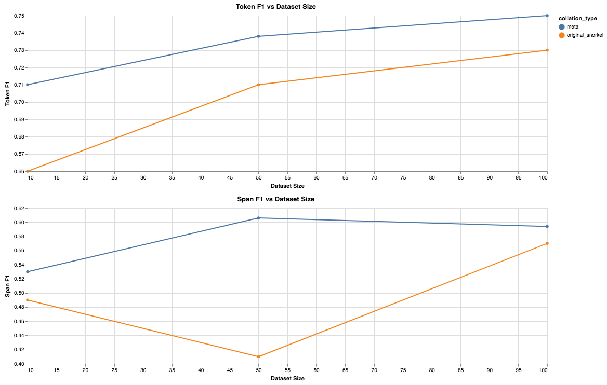
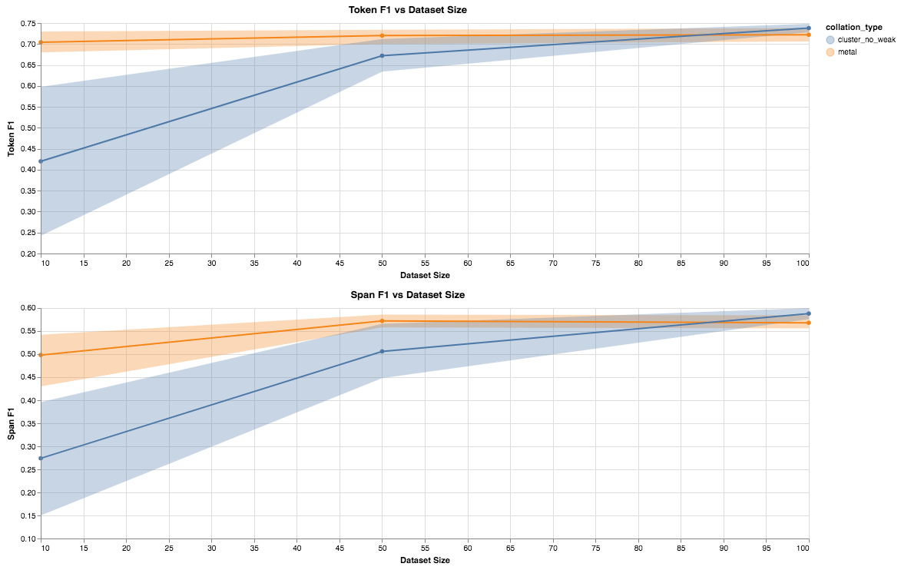
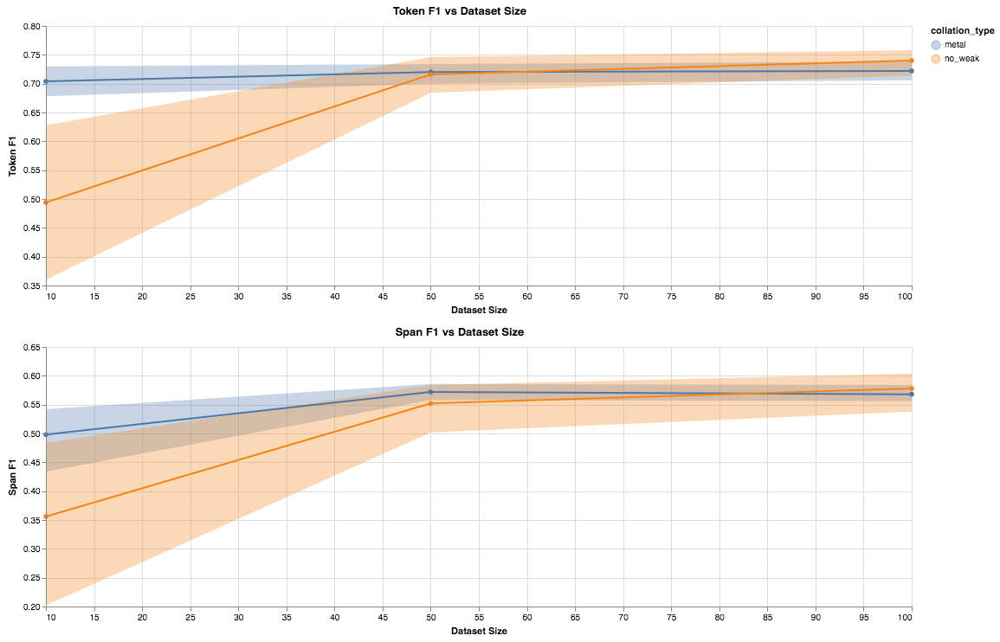

# Advance Solution #2 (Kinda)

[Blog Main Page](README.md): has links to all the previous blog posts.

## Addressing things from the last blog post

### Snorkel Labeling Functions

One of the comments on my [last blog post](blog_7.md), was `does snorkel expect the +/- functions for a given word to be consistent with each other? (e.g., if the + function returns positive, then the corresponding - one should return void)`.

* Snorkel assumes no relation between two labeling functions. Labeling functions disagree quite often, and they help snorkel learn. Predicting VOID for a label for a function, is mostly there to help convery uncertainty in the labeling function.

## Continuing work on the Active Learning Environment

During the past week, the main thing I have been focusing on is experimenting with ways to improve the F1 performance given the current pipeline. I will go into the details of various things I have tried, am trying, and where I plan to go with the final weeks coming up.

### Overview

As a quick reminder (and since I created this image for my most recent in class update), the pipeline I am working with looks like the following:


The steps are as follows:

1. Extract a series of features from our labeled data
    * The feautres I use right now are POS tags, Word features, GloVe Vectors, ELMo Vectors, BERT Vectors
2. Train a series of Weak Classifiers on each of these features individually
    * These could be `kNN`, `SVMs`, `exact matches (dictionary)`
    * They could also operate at the word level or the window level, where window contains the previous and post `k` words. I use `k in {1, 2}`.
3. Evaluate these classifiers to create K views of the data
4. Collate these views together with Snorkel to produce our final weak set
5. Weighted Training
    * From [previous blog posts](blog_5.md), we conclude the best weight for our noise set is `0.1`.

The image is also color coded. `Green` is previous work that I have been doing, namely an active learning system for sequence classification. `Yellow` is the work I am directly working on in this project, and `Red` is other work I am using (Snorkel).

Now that the approach is clear, I attempted a potpurri of low hanging fruit to improve each of these components, which I will delve into below.

### Parallelizing and Multiprocessing

As mentioned in the previous blog post, I have continued work in making this pipeline more parallel and memory efficent. I have reduced most of the memory errors that have occured, and am putting out fires as they occur, but the pipeline is more or less parallel with the weak function generation, training, and evaluation giving a signficant speed up to earlier.

Lucy also pointed out the use of `torch.multiprocessing`, and I have been trying to use it more and more to help with some of the memory issues.

### Labeling Function Analysis

To analyze our labeling functions, I take a look at a matrix of coverage, overlaps, conflicts, and polarity. I breifly described this in the [previous blog post](blog_7.md), but to reiterate

* **coverage**: Perecent of dataset labeled with non void
* **overlaps**: Percent of dataset labeled that another function has labeled as well
* **conflicts**: Perecent of labels that conflict with anotehr labeling function
* **polarity**: Classes predicted (1 means negative, 2 means positive)

In the previous blog post, I showed the labeling functions and a series of them were predicting positive for every (or nearly every) word in the dataset. Digging into this further, I noticed some issues with the implementation of the one hot word feature extractor for bigram and trigram cases, that was making the predicitons garbage. Fixing this I ran into some issues where representing bigrams as a concatenation of one hot vectors or even bag of words (sum of one hot vectors) was taking up too much space to apply it in the scale I wanted with the compute I have. I did some investigations to implement the SVMs and store to utilize sparse matricies, however this did not help much, and there was not much gain from using these labeling functions so I dropped them.

The resulting labeling function summary table is below:

```text
lf_id    Polarity  Coverage  Overlaps  Conflicts
0      [1.0, 2.0]  0.495614  0.495614   0.458154
1               2  0.229789  0.229789   0.218006
2      [1.0, 2.0]  0.362296  0.362296   0.332534
3      [1.0, 2.0]  0.884126  0.884126   0.811340
4      [1.0, 2.0]  0.905446  0.905446   0.829189
5      [1.0, 2.0]  0.955718  0.955718   0.878421
6      [1.0, 2.0]  0.952871  0.952871   0.875398
7      [1.0, 2.0]  0.902730  0.902730   0.825980
8      [1.0, 2.0]  0.907657  0.907657   0.830152
9               2  0.866299  0.866299   0.853060
10              2  0.798550  0.798550   0.785322
11     [1.0, 2.0]  0.859827  0.859827   0.789582
12     [1.0, 2.0]  0.887531  0.887531   0.811252
13     [1.0, 2.0]  0.964007  0.964007   0.887345
14     [1.0, 2.0]  0.961620  0.961620   0.884881
15     [1.0, 2.0]  0.875453  0.875453   0.798879
16     [1.0, 2.0]  0.876614  0.876614   0.799470
17              2  0.530075  0.530075   0.517767
18              2  0.236184  0.236184   0.226241
19     [1.0, 2.0]  0.662845  0.662845   0.597363
20     [1.0, 2.0]  0.684198  0.684198   0.616187
21     [1.0, 2.0]  0.941877  0.941877   0.864623
22     [1.0, 2.0]  0.930478  0.930478   0.852885
```

This table shows that our labeling functions are covering a good variety of our input and predicting different things. They also conflict with each other which is good since it provides additional signal to learn from. While there is most likely room for improvement, we fix this componenet of the pipeline and focus on other components instead.

### Structure Learning and Traditional Snorkel

I have briefly mentioned this in the other blog posts, but instead of the original Snorkel implementation [5 Ratner et al. 2017], I have been working with Snorkel MeTal [3 Ratner et al. 2019] a very recent successor that was used to establish quite a good score on GLUE (though the details of this are missing). There were a series of improvements to the generative model that snorkel builds, but it is missing some features as well. In particular, there was a paper on sturcture learning [4 Bach et al. 2017], that analyzes dependencies between labeling functions to better model the generative model, this is not yet integrated into the MeTal release, but is in the original snorkel work.

I implemented another version of the collator that relies on the original snorkel implementation along with this dependency learning component. The results however, show that this is much worse than using Snorkel MeTal.



Digging into this further, I found some explanations in the papers associated with these projects that could lead to the difference:

1. Metal introduces a matrix completion algorithm that makes this process significantly quicker and does not scale with the dataset size. [3 Ratner et al. 2019]. From my experiments the difference here was 1-2 seconds for MeTal to complete, and 5-10 minutes for original snorkel to complete.
2. MeTal models some conditionals explictily in the model. I am not quite sure how this affects our overall performance, but it is clear that this model is capable of helping more than traditional snorkel.

### Cluster Sampling of Sentence Embeddings

The next thing we hypothesize is that our random sampling might not be capturing enough variance in our data to build a diverse set of labeling functions. To counter act this we look to cluster sample. In particular, given some sample size `s`, we take our unlabeled data and form sentence embeddings through average `ELMo` embeddings. We then form `s` clusters through `kMeans` and sample a point from each of the `s` clusters. Our intuition here is that if we sample the `s` most diverse points, our weak labeling functions / classifiers will be able to learn many different aspects of the data. While random sampling may asymptotically guarantee the same thing, we are working so far from the asymptote (10, 50, and 100 labeled instances), that we need to explicitly make sure this happens. Our results are presented below:

First, we run an experiment comparing this new sample method with no weak set against our snorkel collation. The results are presented below:



We can see that MeTal collation pipeline out performs our random baseline with this sampling strategy, except for dataset size `100`.

Now we compare this method against our previous baselines, namely `no_weak` with random sampling and and `metal` with this clustering sampling, and we notice that the improvement we have previously is gone.



Digging into this further, it could be because during training, I specify the trainer to select the model with the best `CRF` loss. However, as I analyze the model outputs, I realize that the lowest `CRF` loss might not be the highest `F1` score in either Token or Span F1. I am adjusting it so that the model selected is the one with the best `Span F1` from each train iteration. However this will not complete in the scope of this blog post, but should be done within the next day or so. Hopefully these results show a stronger improvement, however our baseline approach will most likely increase as well.

## Next week

With our final weeks approaching, the last thing I want to focus on is improving training through the methods described in the unsupervisied data augmentation paper [2 Xie et al. 2019], and some inspiration from multi task learning. In particular, one thought I had is that this can be viewed as similar to the cross view training paper [1 Clark et al. 2018], where instead of looking at different views through slices of our data, we look at different views by features extracted, and maybe some connection can be made that every feature I look at is somewhat captured by the ELMo vectors (just a thought I had).

It has taking me longer than expected to get to that point, namely I was suppose to do that this week, but there were a series of other implementation and experimental details I wanted to try first throughout the pipeline to see if I could fix any gaping holes.

Concretely, I want to try:

* Phrasing this problem as a multitask one, where the noisy set is seen as a related but seperate task. The goal here would be that the noisy set could be used to guide the hidden states of the model, and the gold set could freeze some of the layers of the model in order to reduce the number of parameters trained.
* Training Signal Annealing (from Unsupervised Data Augmentation [2 Xie et al. 2019]), a method to stop training on instances the model is already confident about.


## References

1. Semi-Supervised Sequence Modeling with Cross-View Training
    - Kevin Clark and Minh-Thang Luong and Christopher D. Manning and Quoc V. Le
    - 2018 EMNLP
    - [Paper](https://www.semanticscholar.org/paper/Semi-Supervised-Sequence-Modeling-with-Cross-View-Clark-Luong/0c47cad9729c38d9db1f75491b1ee4bd883a5d4e)
2. Unsupervised Data Augmentation
    - Qizhe Xie, Zihang Dai, Eduard Hovy, Minh-Thang Luong, Quoc V. Le
    - 2019 Arxiv
    - [Paper](https://arxiv.org/abs/1904.12848)
3. Training Complex Models with Multi-Task Weak Supervision
    - Alexander Ratner, Braden Hancock, Jared Dunnmon, Frederic Sala, Shreyash Pandey, Christopher Ré
    - 2019 AAAI
    - [Paper](https://arxiv.org/abs/1810.02840)
4. Learning the Structure of Generative Models without Labeled Data
    - Stephen H. Bach, Bryan He, Alexander Ratner, Christopher Ré
    - 2017 Proceedings of machine learning research
    - [Paper](https://arxiv.org/abs/1703.00854)
5. Snorkel: Rapid Training Data Creation with Weak Supervision
    - Alexander J. Ratner and Stephen H. Bach and Henry R. Ehrenberg and Jason Alan Fries and Sen Wu and Christopher R'e
    - 2017 VLDB
    - [Project Website](https://hazyresearch.github.io/snorkel/)
    - [Paper](https://arxiv.org/abs/1711.10160)