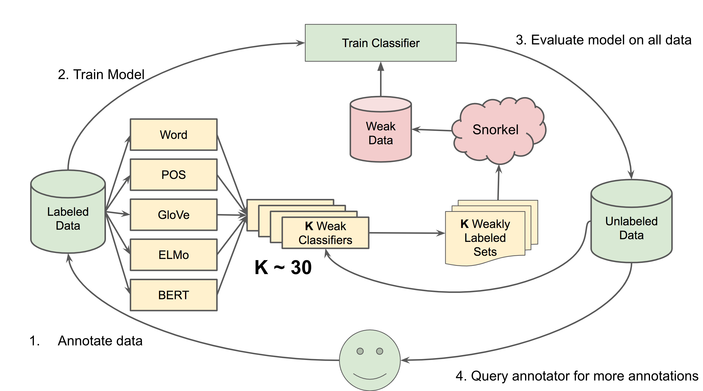
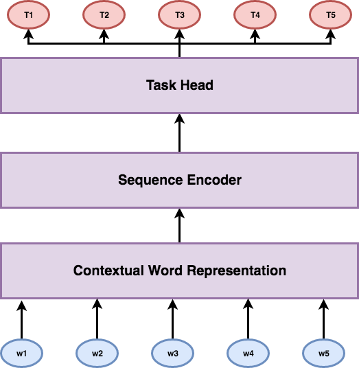
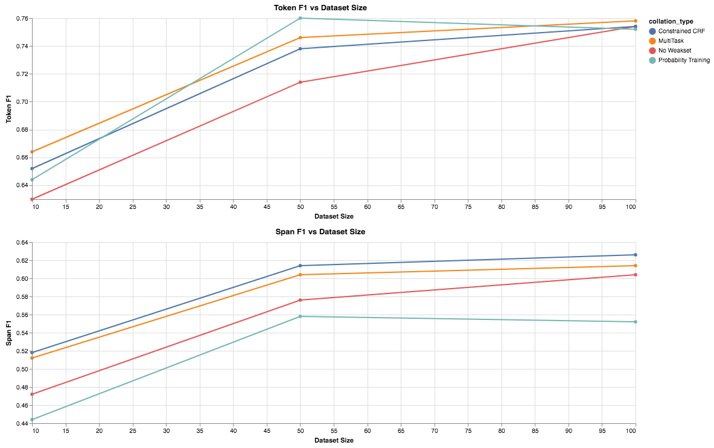

# Advanced Solution #2

[Blog Main Page](README.md): has links to all the previous blog posts.

## Overview

As a quick reminder, I included a visual of the pipeline I have been working with. For more detail about the individual components, my [previous blog post](blog_8.md) has more details.

## Modeling

Throughout the past week (since the last blog post), I have been experimenting with various different modeling architectures and training methods, to see if I can get some gain here. In this blog post, I will address all of them and go through the results.

## Model

The basic template I have been using for the model goes as the following, from bottom up.

1. Contextual Word Representation (CWR) Layer
    * Been focused on `ELMo` here
    * Has been used as a frozen feature extractor
2. Sequence Encoder
    * Takes output of `CWR` and encodes it through some sequence
    * Previous experiments use a bidrectional LSTM
3. Classification Task Head
    * This component is tasked with producing our final output, namely `BIO` encoded tags
    * Been using a traditional CRF

### Constrainted CRF

The first thing I experimented with was replacing the traditional CRF with a constrained CRF. The constrained CRF doesn't just learn the traditional transitions but is aware of BIO encoding, so it only allows legal transitions. For example, it will not allow the following sequence to be decoded `O O I B O`, but would allow `O O B I O` since `I` cannot come after `O`.

This rather simple change, made quite a drastic improvement. In particular take a look at the graph below. Simply using this new task head has a statistically significant increase on `Span F1` over our baseline, however not much of an improvment over the `Token F1` baseline.

### Transformer Sequence Encoder

I experimented with adding a few layers of Multihead Attention in place of the BiLSTM, however I was struggling a bit to get it to work. The CRF loss would quickly explode to `NaN`, even when I considerably lowered the learning rate. Since, I was not able to get this to work after some time and it was just one component of the model, which is a part of a larger pipeline, I decided to move past this approach. Given more time, I think this could be benefitial especially on this dataset since, inputs can be quite long (~100 words on average with a std-dev of ~80).

### Training on Soft Labels

In our pipeline, the way we collate the labels from our weak classifiers is through a machine learning system called `Snorkel` [1 Ratner et al. 2017]. Snorkel is another machine learning model, and in previous experiments I have been the hard predictions (arg max) of this pipeline. However, now I experimented with using soft labels (they are represented as a discrete distribution), for example instead of getting the label `B` for a word, the system would give `[0.7, 0.2, 0.1]` correspoinding to `[B, I, O]`. The results here are interesting, showing that there is some improvement for `Token F1` but a loss in `Span F1`. The intuition here is that the uncertainty in the predicted label can propogate to the label where as with using hard label this won't happen.

In order to train a model on such distributions it was not trivial to me to use a `CRF`, so instead I used the Linear task head instead of the Constrained CRF.

### MultiTask Training

Now that one model provides better Token F1 and one provides better Span F1. We experiment with how to combine both of them together. The CRF is better for hard labels, and the linear is better for soft labels, so when training the model I had the task head switch depending on which labels the model was training on. I also experimented with things like 70% of the time train the Linear head on soft labels the other 30% of the time train the CRF head on the argmax of the soft labels. I also tried freezing the BiLSTM layer when training on the gold set, to help prevent overfitting.

### Modeling Results

In the figure below I show the result from the various experiments I described above.

* **No Weakset (baseline)**: Trains the best performing model (Constrained CRF) on only the gold data
* **Constrained CRF**: trains the constrained CRF on the gold and weak set
* **Probability Training**: trains on the soft labels in the weakset instead of the hard ones
* **MultiTask**: Combines the CRF and Probability training with Linear head as described in the MultiTask section

Looking at these results we can see that Probability training gives an increase on the `Token F1` but constrained CRF gives a much better `Span F1`. This makes sense since the constrained CRF is able to reason about sequences of tags better and is dependent on previous tags. The Linear training with the soft labels is able to gather a greater coverage on the Tokens themselves and recognize more, but with a relatively small amount of labeled data, it is not able to properly form sequences. This lead me to build the MultiTask approach. The MultiTask approach does better than the baseline in both `Token F1` and `Span F1`, but worse than linear on `Token F1`, and worse then CRF on `Span F1`, which means there is still room for improvement. As I mention in my next steps, this may be able to get resolved by training a CRF on soft labels, since the model will be able to leverage the sequence constraints in the CRF and use the soft labels instead of the hard labels in the weak set.

## Next steps

Now that there are some results for the dataset sizes I experimented with on the CADEC dataset (identifying adverse drug reactions) [2 Karimi et al. 2015]. I will be focusing on making this pipeline general and ensuring I did not overfit to the task and dataset sizes at hand. As I work towards this, I will be dealing with any of the issues that come up when trying to generalize it.

Also, the main reason I used the Linear task head was because training on soft labels for a CRF was quite confusing to me. However, after talking to Noah, I think I can implement a way to experiment with soft training for a CRF and hope to try that as well.

## References

1. Snorkel: Rapid Training Data Creation with Weak Supervision
    - Alexander J. Ratner and Stephen H. Bach and Henry R. Ehrenberg and Jason Alan Fries and Sen Wu and Christopher R'e
    - 2017 VLDB
    - [Project Website](https://hazyresearch.github.io/snorkel/)
    - [Paper](https://arxiv.org/abs/1711.10160)
2. Cadec: A corpus of adverse drug event annotation
    - Sarvnaz Karimi and Alejandro Metke-Jimenez and Madonna Kemp and Chen Wang
    - 2015 Journal of biomedical informatics
    - [Paper](https://www.ncbi.nlm.nih.gov/pubmed/25817970)